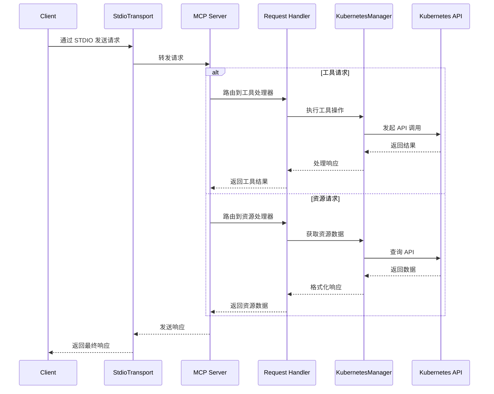

# MCP Server Kubernetes

[](https://github.com/yourusername/mcp-server-kubernetes/actions/workflows/ci.yml)
[](https://github.com/yourusername/mcp-server-kubernetes)
[](https://bun.sh)
[](https://kubernetes.io/)
[](https://www.docker.com/)
[](https://github.com/Flux159/mcp-server-kubernetes/stargazers)
[](https://github.com/Flux159/mcp-server-kubernetes/issues)
[](https://github.com/Flux159/mcp-server-kubernetes/pulls)
[](https://github.com/Flux159/mcp-server-kubernetes/commits/main)
[](https://smithery.ai/protocol/mcp-server-kubernetes)

这是一个可以连接并管理 Kubernetes 集群的 MCP 服务器。

https://github.com/user-attachments/assets/f25f8f4e-4d04-479b-9ae0-5dac452dd2ed

<a href="https://glama.ai/mcp/servers/w71ieamqrt"></a>

## 在 Claude Desktop 中使用

将以下配置添加到 Claude Desktop 的配置文件中：

```json
{
  "mcpServers": {
    "kubernetes": {
      "command": "npx",
      "args": ["mcp-server-kubernetes"]
    }
  }
}
```

服务器将自动连接到你当前的 kubectl 上下文。请确保你已经：

1. 安装了 kubectl 并添加到 PATH 环境变量中
2. 有有效的 kubeconfig 文件和已配置的上下文
3. 可以访问已配置 kubectl 的 Kubernetes 集群（如 minikube、Rancher Desktop、GKE 等）
4. 安装了 Helm v3 并添加到 PATH 中（如果不使用 Helm 功能则可选）

你可以通过让 Claude 列出 pods 或创建测试部署来验证连接是否成功。

如果遇到错误，请打开终端并运行 `kubectl get pods` 来检查是否可以在没有凭证问题的情况下连接到集群。

## 使用 mcp-chat

[mcp-chat](https://github.com/Flux159/mcp-chat) 是一个用于 MCP 服务器的命令行聊天客户端。你可以用它来与 Kubernetes 服务器交互。

```shell
npx mcp-chat --server "npx mcp-server-kubernetes"
```

或者，你可以使用上面的 Claude Desktop 配置文件（Linux 用户需要使用正确的配置文件路径）：

Mac:

```shell
npx mcp-chat --config "~/Library/Application Support/Claude/claude_desktop_config.json"
```

Windows:

```shell
npx mcp-chat --config "%APPDATA%\Claude\claude_desktop_config.json"
```

## 功能特性

- [x] 连接到 Kubernetes 集群
- [x] 列出所有的 pods、services、deployments、nodes
- [x] 创建、描述、删除 pod
- [x] 列出所有命名空间，创建命名空间
- [x] 创建自定义 pod 和 deployment 配置，更新 deployment 副本数
- [x] 获取 pod 的日志用于调试（支持 pods、deployments、jobs 和标签选择器）
- [x] 支持 Helm v3 安装 charts
  - 使用自定义值安装 charts
  - 卸载发布
  - 升级现有发布
  - 支持命名空间
  - 支持版本指定
  - 支持自定义仓库
- [x] 支持 kubectl explain 和 kubectl api-resources
- [x] 获取集群中的 Kubernetes 事件
- [x] 端口转发到 pod 或 service
- [x] 创建、列出和描述 cronjobs

## 本地开发

```bash
git clone https://github.com/Flux159/mcp-server-kubernetes.git
cd mcp-server-kubernetes
bun install
```

### 开发工作流

1. 在开发模式下启动服务器（监视文件变化）：

```bash
bun run dev
```

2. 运行单元测试：

```bash
bun run test
```

3. 构建项目：

```bash
bun run build
```

4. 使用 [Inspector](https://github.com/modelcontextprotocol/inspector) 进行本地测试：

```bash
npx @modelcontextprotocol/inspector node dist/index.js
# 按照终端上的进一步说明打开 Inspector 链接
```

5. 使用 Claude Desktop 进行本地测试：

```json
{
  "mcpServers": {
    "mcp-server-kubernetes": {
      "command": "node",
      "args": ["/path/to/your/mcp-server-kubernetes/dist/index.js"]
    }
  }
}
```

6. 使用 [mcp-chat](https://github.com/Flux159/mcp-chat) 进行本地测试：

```bash
npm run chat
```

## 贡献

详情请参阅 [CONTRIBUTING.md](CONTRIBUTING.md) 文件。

## 高级功能

关于使用 SSE 传输等更高级的信息，请参阅 [ADVANCED_README.md](ADVANCED_README.md)。

## 架构

本节描述了 MCP Kubernetes 服务器的高级架构。

### 请求流程

下面的序列图说明了请求如何在系统中流动：



## 发布新版本

前往 [releases 页面](https://github.com/Flux159/mcp-server-kubernetes/releases)，点击 "Draft New Release"，点击 "Choose a tag" 并通过输入使用 "v{major}.{minor}.{patch}" semver 格式的新版本号来创建新标签。然后，写一个发布标题 "Release v{major}.{minor}.{patch}" 和描述/更新日志（如有必要），点击 "Publish Release"。

这将创建一个新标签，触发通过 cd.yml 工作流程的新版本构建。一旦成功，新版本将发布到 [npm](https://www.npmjs.com/package/mcp-server-kubernetes)。注意，无需手动更新 package.json 版本，因为工作流程会自动更新 package.json 文件中的版本号并推送提交到主分支。

## 未计划功能

认证/向 kubectx 添加集群。 